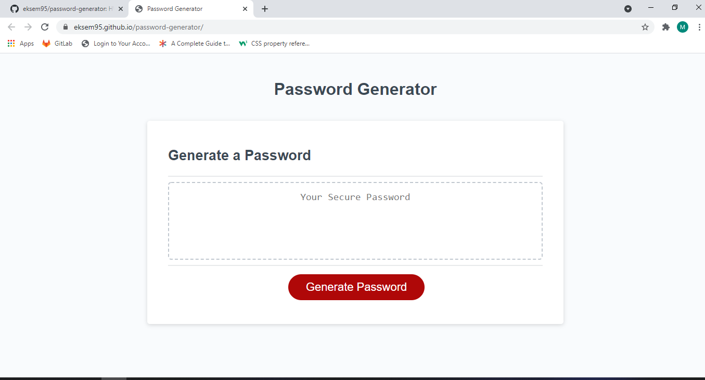

# password-generator

Live deployment: https://eksem95.github.io/password-generator/

HW 3 assignment: This application randomly generate a password after clicking a button. it Prompts users for the types of characters to be included in the password as well as the length. Then it displays the password on the page. 

